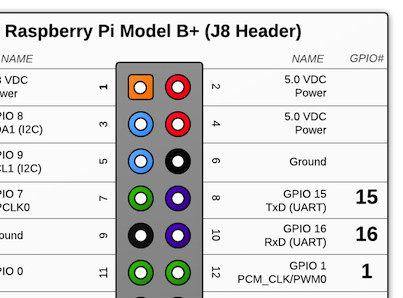
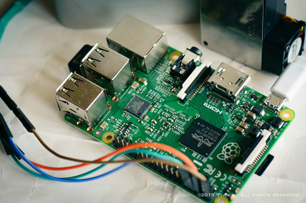

# 攀藤PMS3003传感器

## 材料
* Raspberry Pi 2 model B
* 攀藤PMS3003(G3)数字式通过颗粒物浓度传感器
* 杜邦线若干
* 5V电源
* Java & Pi4J

## 安装Pi4J
### 自动安装
    curl -s get.pi4j.com | sudo bash

### 手工安装
    wget http://get.pi4j.com/download/pi4j-1.0.deb
    sudo dpkg -i pi4j-1.0.deb

## 禁用系统将串口做为tty
> 串口默认配置是系统控制台,需要关闭这个配置才能让程序使用串口。

    sudo vim /boot/cmdline.txt
* 删除内容: `console=ttyAMA0,115200 elevator=deadline`
* 增加内容: `rpitestmode=1`

### 修改完以后的/boot/cmdline.txt:
    dwc_otg.lpm_enable=0 rpitestmode=1 console=tty1 root=/dev/mmcblk0p2 rootfstype=ext4 rootwait

### 重启
    sudo reboot

### 编译inittab
    sudo vim /etc/inittab
寻找 `#Spawn a getty on Raspberry Pi serial line` 注释掉它的下一行 `#T0:23:respawn:/sbin/getty -L ttyAMA0 115200 vt100`

### 再次重启
    sudo reboot

### 可安装minicom测试下串口
    sudo apt-get install minicom
    minicom -b 115200 -o -D /dev/ttyAMA0

[引用irrational.net](http://www.irrational.net/2012/04/19/using-the-raspberry-pis-serial-port/)

## 生成工程文件
    gradle idea

## 数字管脚定义
    数字式通过颗粒物浓度传感器.
    PMS2001,PMS2003,PMS3003数字管脚定义.
    主要输出为单位体积内各浓度颗粒物质量及个数(视具体型号).

|PIN        |定义         |说明         |电压         |
|----------:|-----------:|------------:|:-----------|
|PIN1       |VCC         |电源正5V      |-            |
|PIN2       |GND         |电源负        |-            |
|PIN3       |SET         |设置pin       |/TTL电 平@3.3V|
|PIN4       |RXD         |串口接收管脚   |/TTL电 平@3.3V|
|PIN5       |TXD         |串口发送管脚   |/TTL电 平@3.3V|
|PIN6       |RESET       |模块复位信号   |/TTL电 平@3.3V|
|PIN7/8     |NC          |悬空          |-            |

> **NOTE:**
> * 1针为控制信号接口,采用高低电平控制.
> * 2针为串行数据通信接口,采用通用异步收发协议(UART);
> * 所有电平均为3.3V TTL电平.

## 传输协议
    数字式通过颗粒物浓度传感器PMS2003, PMS3003传输协议

|数据         |功能                                 |
|------------:|:-----------------------------------|
|起始符1       |0x42(固定)                           |
|起始符2       |0x42(固定)                           |
|帧长度高八位   帧长度低八位  |帧长度=2x9+2(数据+校验位)              |
|数据1高八位   数据1低八位  |数据1表示PM1.0浓度(CF=1,标准颗粒物)单位ug/m3              |
|数据2高八位   数据2低八位  |数据2表示PM2.5浓度(CF=1,标准颗粒物)单位ug/m3              |
|数据3高八位   数据3低八位  |数据3表示PM10浓度(CF=1,标准颗粒物)单位ug/m3              |
|数据4高八位   数据4低八位  |数据4表示PM1.0浓度(大气环境下)单位ug/m3              |
|数据5高八位   数据5低八位  |数据5表示PM2.5浓度(大气环境下)单位ug/m3              |
|数据6高八位   数据6低八位  |数据6表示PM10浓度(大气环境下)单位ug/m3              |
|数据7高八位   数据7低八位  |数据7(保留) |
|数据8高八位   数据8低八位  |数据8(保留) |
|数据9高八位   数据9低八位  |数据9(保留) |
|数据和校验高八位  数据和校验低八位    |校验码=起始符1+起始符2+...+数据9低八位 |

> **NOTE:**
> * 串口默认波特率9600Kbps, 校验位:无, 停止位:1位
> * PMS2003、PMS3003都是24个字节
> * PMSX003 有32个字节。
> * CF=1        根据美国TSI公司的仪器校准
> * 大气环境下   根据中国气象局的数据校准

## PMS3003 PIN 排列

## Raspberry Pi连接 PMS3003
    PMS3003 PIN1(VCC) -> Raspberry Pi PIN2(5.0 VDC)
    PMS3003 PIN2(GND) -> Raspberry Pi PIN6(Ground)
    PMS3003 PIN4(RXD) -> Raspberry Pi PIN8(TxD UART)
    PMS3003 PIN5(TXD) -> Raspberry Pi PIN10(RxD UART)

## 成品图

